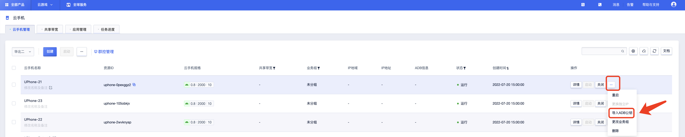
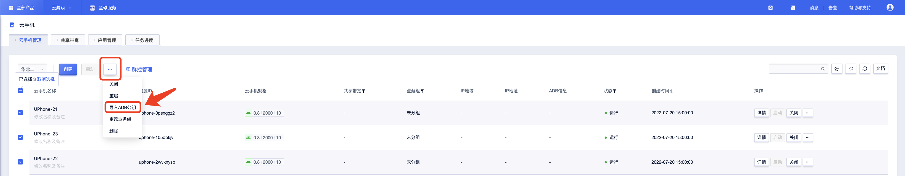
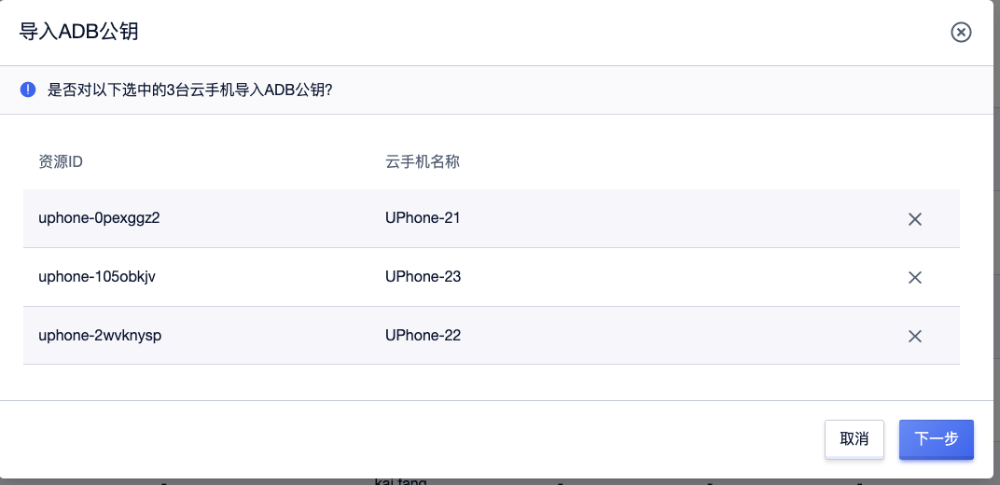
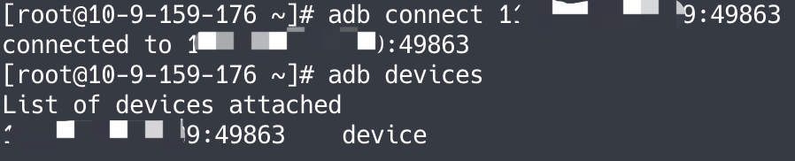

## ADB连接
>注意：绑定独立IP的云手机暂不支持ADB连接
### 控制台操作
>把下列【环境配置】中生成的公钥进行导入。
### 一、单个手机或者批量手机导入
#### 1、单个手机导入 

#### 2、批量手机导入

### 二、选择【下一步】

### 三、点击【确定】

### 环境配置
### 一、下载ADB工具
#### 访问：https://developer.android.com/studio/releases/platform-tools, 下载对应平台的文件并解压。

### 二、生成密钥对
#### 使用命令行工具，进入解压后的目录，执行命令：adb devices，生成adb密钥对。
#### 说明 ：
#### 默认情况下，ADB 服务器生成的密钥对以 adbkey（私钥）和 adbkey.pub（公钥）的形式存储在以下密钥存储库目录中。
* Linux操作系统，文件位置为：~/.android
* Windows 操作系统，文件位置为：C:\Users\%USERNAME%\\.android
* MacOS 操作系统，文件位置为：~/.android
>如将密钥删除，或想重新生成密钥对，可先执行：adb kill-server，再执行：adb devices。

### 三、连接
#### 执行ADB命令：adb connect $ip:$port，创建与云手机的ADB连接。(导入公钥后控制台可查看$ip:$port)
#### 查看连接是否成功：adb devices。
#### 截图以CentOS操作系统为示例：

