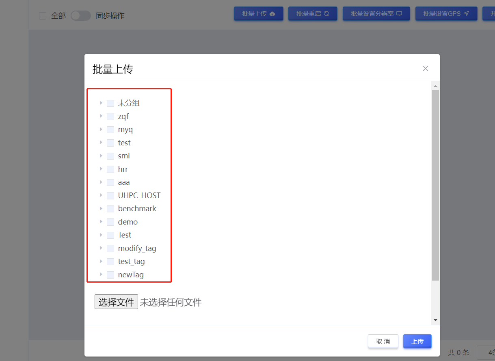
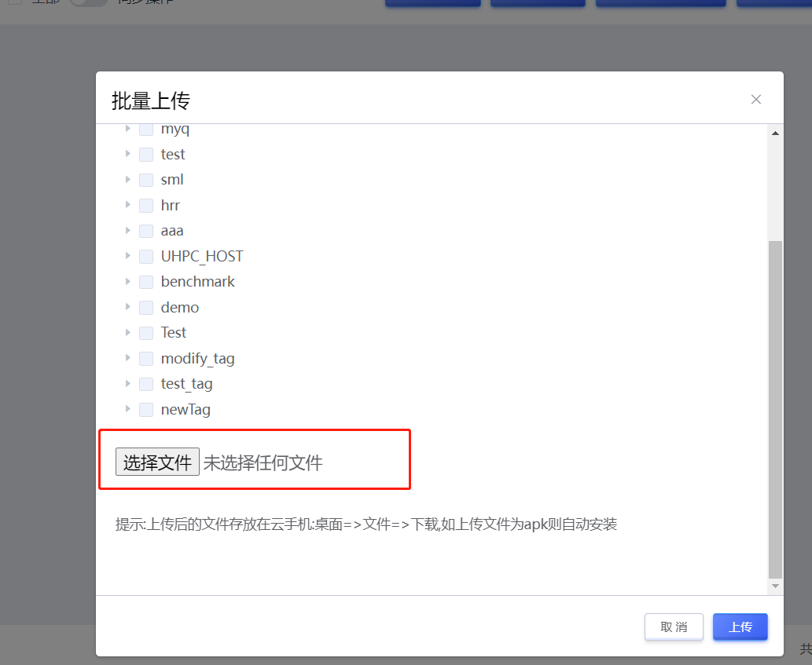
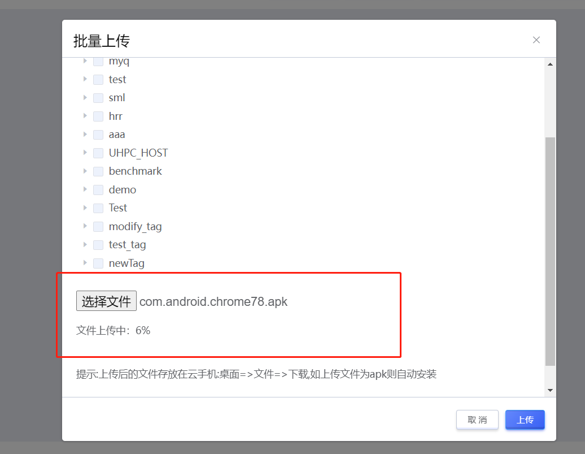

## 操作指南
### 注册账号
 
 
### 创建云手机
 
 
### 群控管理
### 文件上传
#### 1.选择需要上传文件的云手机
 
 #### 2.选择需要上传的文件,暂时仅支持单文件上传,后续会支持多文件上传
 
 #### 3.上传进度为100%时，上传文件成功,如上传文件为apk,云手机会自动安装，安装包及其他类型的文件可在"文件管理→下载"中查看
 
### 一键新机
#### 通过一键新机，云手机会随机更换手机机型及其相关的设备参数（注意：一键新机操作需要重启云手机）
##### 目前一键新机支持的机型
|品牌             |型号                     |
|:-----------------|:-----------------------|
|华为|Huawei P30 pro|
|OPPO|Oppo R11 Plus|
|三星|Samsung S10|
|红米|Redmi Note9|
|华为|Huawei Mate 10|
|华为|Huawei  P30 Pro|
|小米|Xiaomi MIX 2|
|三星|Samsung Galaxy S10|
|三星|Samsung Galaxy S20 Ultra|
|华为|Huawei P20 Pro|
|OPPO|Oppo R11Plus|
|红米|Redmi 10X|
|小米|Xiaomi 6X|
#### 1.在群控页面左侧列表选择需要进行设置的云手机
 
#### 2.在群控页面右上角功能栏点击“一键新机”按钮
 
#### 3.一键新机需要重启云手机，点击确定后，Web页面会出来“正在重启”提示，需等待重启完成，一键新机设置才能生效
 
#### 4.Web页面等待重启提示消失后，代表一键新机批量设置成功
 
### 开关Root
开启或关闭云手机root(注意：一键新机操作需要重启云手机)
#### 1.在群控页面左侧列表选择需要进行设置的云手机

#### 2.在群控页面右上角功能栏点击“开启ROOT”或“关闭ROOT”按钮

#### 3.点击确定后，会出来等待提示

#### 4.开关ROOT需要重启云手机，点击确定后，Web页面会出来“正在重启”提示，需等待重启完成，开关ROOT设置才能生效

#### 5.Web页面等待重启提示消失后，代表开关ROOT批量设置成功
### 设置GPS
设置云手机GPS信息
#### 1.在群控页面左侧列表选择需要进行设置的云手机

#### 2.在群控页面右上角功能栏点击“设置GPS”按钮

#### 3.出现批量设置GPS对话框

经度：正数代表东经，负数代表西经
纬度：正数代表北纬，负数代表南纬
#### 4.可以通过点击“拾取”按钮，打开百度地图坐标拾取系统获取准确经纬度，复制后粘贴在设置对话框里

#### 5.经纬度填写完成后批量设置GPS对话框右下角设置按钮即设置完成
### 自制镜像
#### 1.创建镜像
  
 
#### 2.查看镜像

#### 3.使用自制镜像创建云手机服务器
 
### 云手机独立IP和共享带宽
 ### 快速测试
  云手机所在地域包括华北二和广州，购买后可直接访问公网，出口使用的是华北二和广州服务器的IP，约40个手机共用一个IP；
  
  如果不希望使用华北二和广州的IP，可以单独选择”云手机独立IP和共享带宽“中所支持的地域，可以实现如下功能：
  
  1. 实现出海    2.改变IP地域    3.实现防关联
  

 
