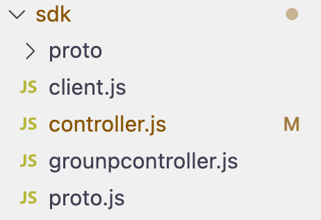

## H5 SDK 下载

|  SDK   | ZIP包 | GitHub |
| :----: | :---: | :----: |
| H5 SDK | [下载](http://uphone-sdk.cn-bj.ufileos.com/uphone-h5-sdk.zip)  |    [GitHub 下载](https://github.com/ucloud/uphone-h5-sdk.git)    |

# 概述

欢迎使用H5 UPhone SDK ，产品能够为开发者提供更便捷接入、高可靠的云手机服务，让开发者快速搭建实时项目。开发者可在H5 UPhone SDK提供的功能基础上开发新功能，同时还可结合官方提供的配套demo进一步了解内置功能，应用场景广阔，开发简单易懂。

# 快速入门&集成SDK 

### 准备环境

在开始集成 H5 UPhone  SDK前，请确保开发环境满足一下要求：

•     准备一台可以连接到互联网的Windows或macOS计算机。

•     使用最新版本的Chrome浏览器。

•    网页执行H5标准。

•    viewport设置不可缩放。

###  导入SDK 

1．解压SDK压缩包，将uphone-sdk文件夹放入项目中。*开发者可借鉴官方提供demo。



2. 用户创建媒体界面，并在媒体界面导入"controller.js"、"proto.js"。


 说明：在创建引擎之前，开发者需定义一个id为phone-video的video标签，SDK会在这个元素内加载音视频。video标签设置autoplay、playsinline、webkit-playsinline属性。

示例代码 

```html
<div>
    <video id="phone-video" autoplay="autoplay" playsinline webkit-playsinline></video>
  </div>
<script src="./uphone-sdk/proto.js"></script>
<script type="module">
import controller from "../uphone-sdk/controller.js "; //文件路径不固定
</script>

```

3. 初始化创建引擎实例，创建controller引擎实例，将参数传入。

```js
var Controller = new controller(loadingParams)
```

示例代码 

```html
<div>
    <video id="phone-video" autoplay="autoplay" playsinline webkit-playsinline></video>
  </div>
<script src="./uphone-sdk/proto.js"></script>
<script type="module">
import controller from "../uphone-sdk/controller.js "; //文件路径不固定
//----第一步初始化SDK----
var loadingParams = {
        Id: "替换为可用ID", 
        mediaConstraints: {
            audio: true,
            video: true,
        },
        gamename: "拉起游戏名字",
        jobid: "唯一即可", //
        token:"如果调用api接口SetUPhoneToken进行了设置，此处为必填，否则为可选" 
    }
 var Controller = new controller(loadingParams)
</script>

```

参数说明

Id:可连接的云手机ID。必填

mediaConstraints:连接约束条件。必填 

audio:true/false,为true则获取音频流。

video:true/false,为true则获取视频流

*gamename:**要拉起的游戏名称*

*jobid:**唯一即可*

*token:*如需调用**api**接口**SetUPhoneToken**进行了设置**,**此处为必填。*

#   API接口

### 状态回调函数

具体例子请查看官方demo

示例代码

```js
Controller.onstatus(statustype,callback)
//设备连接状态回调
      Controller.onstatus("devicestatus", (states) => {
        if (states == 1001) {
          console.log("连接设备失败");
        }
        if (states == 1003) {
          console.log("创建设备控制失败");
        }
        if (states == 1008) {
          console.log("服务器应答失败");
        }
        if (states == 1026) {
          console.log("设备已被占用");
        }
        if (states == 73002) {
         console.log("设备不存在");
        }
      });
      //网络连接状态回调
      Controller.onstatus("networkstatus", (states) => {
        if (states == "connected") {
          console.log("网络连接成功");
        }
        if (states == "disconnected") {
          console.log("网络连接失败");
        }
      });
      //启动游戏状态回调
      Controller.onstatus("gamestatus", (states) => {
        if (states == "success") {
          console.log("启动成功");
        }
        if (states == "fail") {
          console.log("启动失败");
        }
      });
      //切换分辨率状态回调
      Controller.onstatus("resolution", (states) => {
        if (states == "success") {
          console.log("切换成功");
        } else {
          console.log("切换失败");
        }
      });

```

| 参数   | 类型 | 必填     | 意义                       |
| ------ | ---- | -------- | -------------------------- |
| states | int  | 回调数据 | 连接状态的回调函数返回数据 |

### 连接云手机

开发者在媒体界面创建实例之后，即可启动云手机建立连接。 

示例代码 

```js
Controller.startConnection();
```

### 获取云手机媒体流

建立信令服务器连接并且p2p连接成功后，即可获取远程媒体流。

示例代码

```js
var stream = Controller.getPhoneStream();
var phoneVideo = document.getElementById("phone-video");
phoneVideo.srcObject = stream;     // 添加视频流到video标签

```

说明 : 目前云手机视频流比例分为1:2或9:16两种。开发者可在video标签方法onloadedmetadata中 获取到视频流实际宽高，根据视频比例设置需要展示的video大小即可。  

如：获取到视频流宽为720，高为1440。video标签可设置宽高保证1:2比例即可。    

### 断开云手机连接

断开连接调用以下接口

示例代码

```js
  Controller.closeConnection();
```

### 重新连接

重新建立云手机连接

示例代码

```js
  Controller.reStart();
```

### 切换分辨率 

切换分辨率时传入规定好的分辨率id，即可切换对应的分辨率

说明：手机端切换分辨率传递id不同，可参照下方参数说明

示例代码

```js
 Controller.changeResolution(id);
```

| 参数 | 类型 | 必填 | 意义                             |
| ---- | ---- | ---- | -------------------------------- |
| id   | int  | 是   | 分辨率数值，具体数值demo中有说明 |

###  获取最后一次操作的时间戳

示例代码

```js
 Controller.getLastTimeStamp();  //单位毫秒
```

### 获取延迟显示

获取网络延迟时间

示例代码

```js
 Controller.getNetDelay((roundtime)  => {console.log(roundtime) //单位毫秒;  
```

| 参数      | 类型 | 必填     | 意义                 |
| --------- | ---- | -------- | -------------------- |
| roundtime | int  | 回调数据 | 延迟回调返回延迟信息 |

### 返回云手机桌面

返回到云手机桌面

示例代码 

```js
 Controller.backHome();  
```

### 一键拉起游戏

调用该方法一键启动云手机内游戏

示例代码

```js
 let message = {
   gamename:"xxx.xxx.xxx", //游戏包名
   jobid: "", //后台区分任务标识，唯一即可   
 };
 Controller.startGame(message);
```

### 清理云手机后台进程

 清理云手机后台应用（前端显示的应用不受影响）

示例代码

```js
 Controller.clearUp()  
```

# 导入官方 Demo 

1. 下载官方demo压缩包，解压文件将文件夹导入到开发工具。

2. 可在本地服务环境下运行，浏览器调试。
